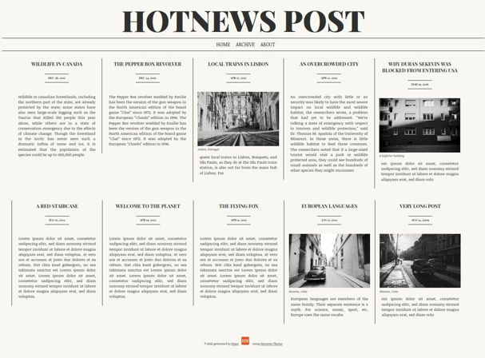

# Description

Simple [hugo](https://gohugo.io) [theme](https://themes.gohugo.io) named `Hotnews` which imitates a newspaper layout.

# Demo

A demo is available on https://hugo-hotnews.netlify.app/

# Screenshot



# Installation

The easiest way to do the installation is using git.
Simply go to the `themes` folder of your hugo site and clone this repository.

```
cd themes
git clone https://github.com/gitrust/hugo-hotnews.git
```

Then head over to your site configuration (`config.toml` or `config.yml`) and specify the new theme.

```
theme = ["hugo-hotnews"]
```

Now restart your hugo server.

# References

I used ideas from following sites to build this theme. Images were
taken from unsplash.com. Using [Krita](https://krita.org) I applied an artistic [filter](https://docs.krita.org/en/reference_manual/filters/artistic.html) named `Halftone` to them.

- https://retrolog.io/blog/creating-a-hugo-theme-from-scratch/
- https://codepen.io/silkine/pen/jldif
- https://randomgeekery.org/post/2016/04/yearly-post-archives-in-hugo/
- https://www.donarmuseum.nl/spelers/ (Year archive listing)
- https://www.smashingmagazine.com/2019/01/css-multiple-column-layout-multicol/ (multi column configuration)
- images from https://unsplash.com
